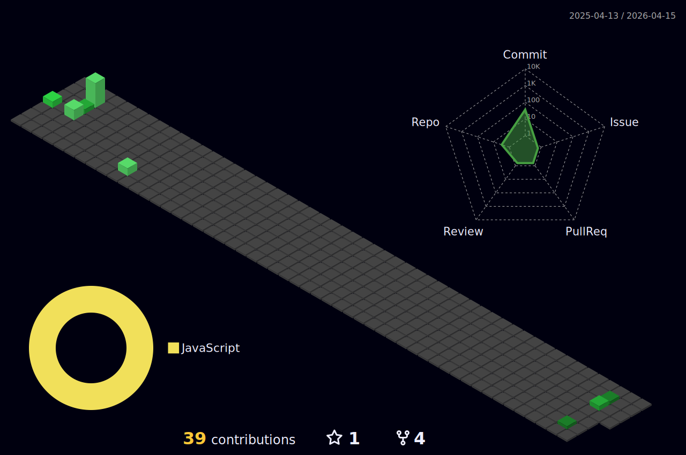

# 💫 About Me:
👋 Hi, I’m @Amardeep111 👀 I’m interested in Full-Stack. 🌱 I’m currently learning HTML,CSS,JavaScript,Python. 💞️ I’m looking to collaborate on Full-Stack developer. 📫 How to reach me Gmail: amardeepsarkar8@gmail.com

## 🌐 Socials:
 

# 💻 Tech Stack:
                        
# 📊 GitHub Stats:

 

  

## 🏆 GitHub Trophies

### ✍️ Random Dev Quote

### 😂 Random Dev Meme

---

</picture>

  

